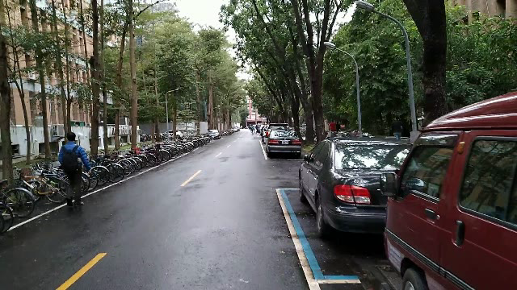
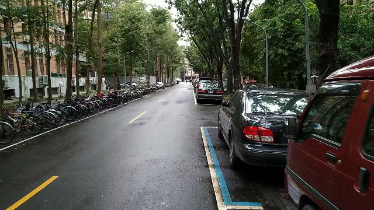

# Visiual Odometry

## Method
### Camera Calibration
Run camera_calibration.py to get the camera intrinsic matrix and distortion coefficient.

[How to use]
$ python camera_calibration.py [CALIBRATE_VIDEO]

### Feature Matching
Use ORB or SIFT to get fratures and matching.

### Pose from Epipolar Geometry

    Algorithm to get pose
    compute findEssentialMat to get the essentail matrix and inlier points by input two frames point correspondence.
    compute recoverPose to get the rotation, normal vector of translation, inlers and 3D triangulated points.
    compute scale factor by calculating current 2d 3d points and previous 2d 3d points.
    multiply scale factor to normal vector of translation to get relative translation.
    Output: Relative rotation and translation.

### Results Visualization
Compute the relative rotation and translation in each frames and draw by open3d.

## Bonus: Loop detection
Code is referenced to [here](https://github.com/itswcg/DBow-Python).

Results:

The result shows that frame_14.png and frame_468.png has the loop.

frame_0014.png|frame_0468.png
|:-:|:-:|
|

## Requirements

* Python: 3.9.7
* open3d: 0.15
* numpy: 1.20
* opencv: 4.6.0

## Usage
    python vo.py ./frames

## Demo
* Vitrual Odometry using SIFT with Loop Detect (NTU campus) [here](https://youtu.be/Mfknrjl1T1I)
* Vitrual Odometry using ORB with Loop Detect (NTU campus) [here](https://youtu.be/jTRPueav8nI)